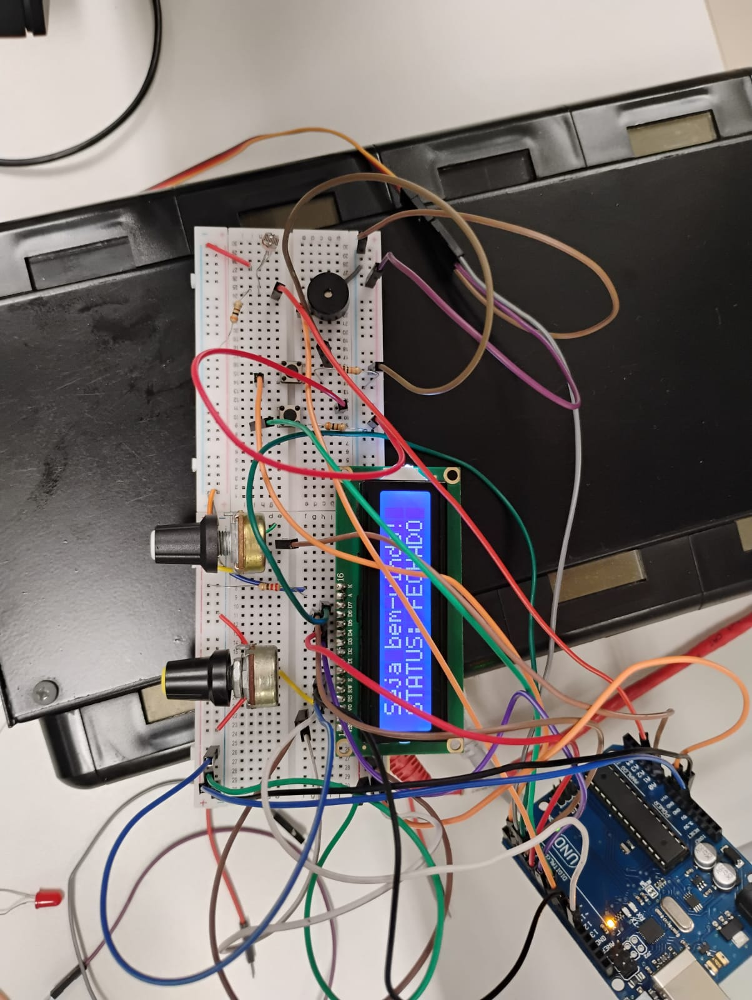

# Sistema de Controle de Acesso — Cofre Inteligente

Implementa um cofre eletrônico com entrada de senha via potenciômetro, validação de acesso, monitoramento por sensor de luz (LDR) e interface visual em display LCD.

---

## 📋 Sumário

- [Visão Geral](#visão-geral)
- [Funcionamento do Sistema](#funcionamento-do-sistema)
- [Senha e Entrada de Dados](#senha-e-entrada-de-dados)
- [Sistema de Bloqueio](#sistema-de-bloqueio)
- [Monitoramento de Segurança (LDR)](#monitoramento-de-segurança-ldr)
- [Interrupção de Reset](#interrupção-de-reset)
- [Como Reproduzir](#como-reproduzir)

---

## Visão Geral

O sistema simula um cofre eletrônico com as seguintes funcionalidades:

- Entrada de senha de 4 dígitos (0–9) via potenciômetro (default: `6969`)
- Validação da senha com feedback visual e sonoro
- Bloqueio automático após 3 tentativas incorretas
- Detecção de invasão por sensor de luminosidade (LDR)
- Abertura/fechamento do cofre por servo motor
- Botão de reset

---

## Funcionamento do Sistema

### Tela Inicial

Ao ligar, o LCD exibe uma mensagem de boas-vindas e o status atual da trava:

```
Seja bem-vindo!
STATUS: FECHADO
```

### Digitando a Senha

1. Gire o potenciômetro para selecionar o dígito desejado (0 a 9).
2. O LCD exibe o dígito atual e asteriscos indicando quantos já foram confirmados:

```
DIGITO: 6
*
```

3. Pressione o **Botão Enviar** para confirmar o dígito.
4. Repita até completar os 4 dígitos.

### Senha Correta

A senha padrão é a sequência de 4 dígitos: **6 9 6 9**

O servo abre o cofre (90°), o LCD exibe confirmação e o buzzer toca uma melodia de sucesso:

```
Senha correta!
Cofre aberto :)
```

### Senha Incorreta

O LCD informa o número de tentativas restantes e o buzzer emite dois bipes graves:

```
Senha errada!
Tentativas: 1/3
```

---

## Sistema de Bloqueio

Após **3 tentativas incorretas** consecutivas, o sistema entra em modo de bloqueio:

- O servo retorna à posição fechada (0°).
- O LCD exibe **"INVASOR DETECTADO!"**
- O buzzer dispara 3 bipes graves de alarme.
- O sistema fica travado em loop infinito.
- A única saída é pressionar o **Botão de Reset**.

O mesmo bloqueio ocorre se o LDR identificar muita luz e a senha correta não tiver sido inserida, simulando o arrombamento do cofre.

---

## Monitoramento de Segurança (LDR)

O LDR é verificado continuamente no `loop()`. Se o valor analógico lido em A1 for menor que a constante `CONST_LUZ` (110), o sistema interpreta como uma tentativa de invasão e aciona o bloqueio imediatamente.

---

## Interrupção de Reset

O reset:
- Zera tentativas e posição da senha
- Fecha o servo
- Exibe "Sistema resetado!" no LCD
- Volta à tela inicial

---

## Como Reproduzir

### Requisitos de Software

- [Arduino IDE](https://www.arduino.cc/en/software) 1.8+ ou 2.x
- Biblioteca **LiquidCrystal** (inclusa por padrão na IDE)
- Biblioteca **Servo** (inclusa por padrão na IDE)

### Passos

1. Monte o circuito conforme o [diagrama elétrico](diagrama_eletrico.pdf).
2. Abra o arquivo `projeto.c` (renomeie para `projeto.ino` se necessário) na Arduino IDE.
3. Selecione a placa correta em **Ferramentas > Placa**.
4. Selecione a porta COM correta em **Ferramentas > Porta**.
5. Clique em **Carregar** (Upload).
6. (Opcional) Use o **Monitor Serial** para acompanhar os logs de debug.

---

# Foto do circuito


